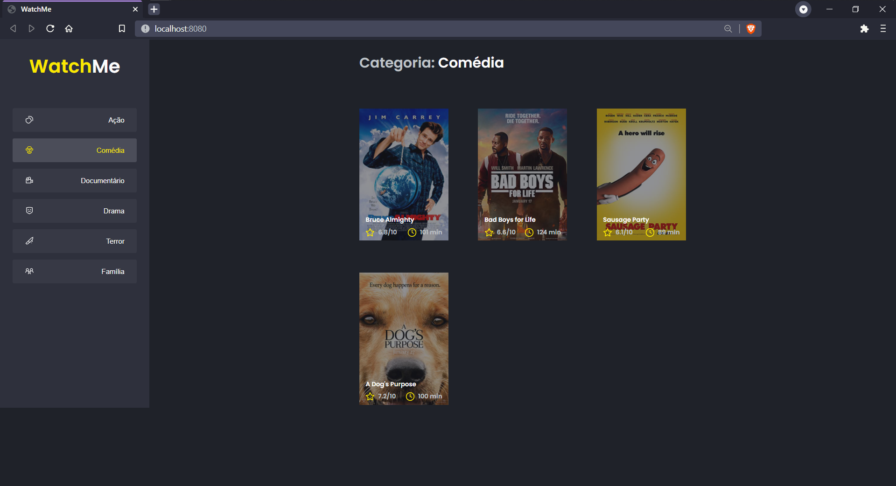

 

# WatchMe

## Desafio 02 - Componentizando a aplicação.

Essa será uma aplicação onde o seu principal objetivo é refatorar uma página para listagem de filmes de acordo com gênero.

A aplicação já está totalmente funcional mas grande parte do seu código está diretamente no arquivo `App.tsx`. Para resolver isso da melhor forma, é necessário dividir a aplicação em **pelo menos** duas partes principais: sidebar e o conteúdo principal que possui o header e a listagem de filmes.

- A aplicação possui apenas uma funcionalidade principal que é a listagem de filmes;
- Na sidebar é possível selecionar qual categoria de filmes deve ser listada;
- A primeira categoria da lista (que é "Ação") já deve começar como marcada;
- O header da aplicação possui apenas o nome da categoria selecionada que deve mudar dinamicamente.

## Scripts

- Front-End - `yarn dev`
- Back-End - `yarn server`
- Testes - `yarn test`

Com 💚 por [Ecthon](https://github.com/ecthon)
